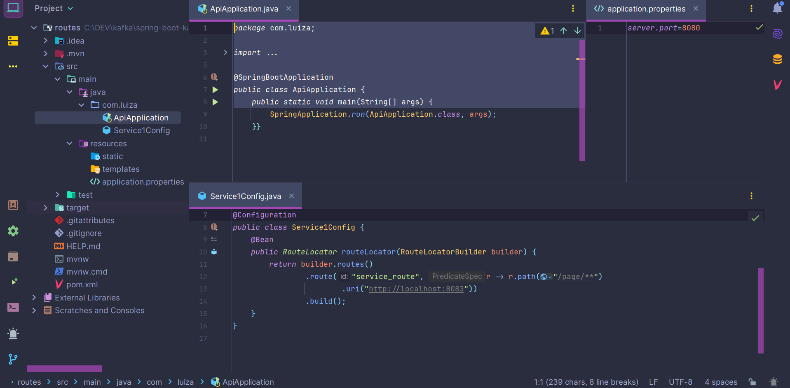
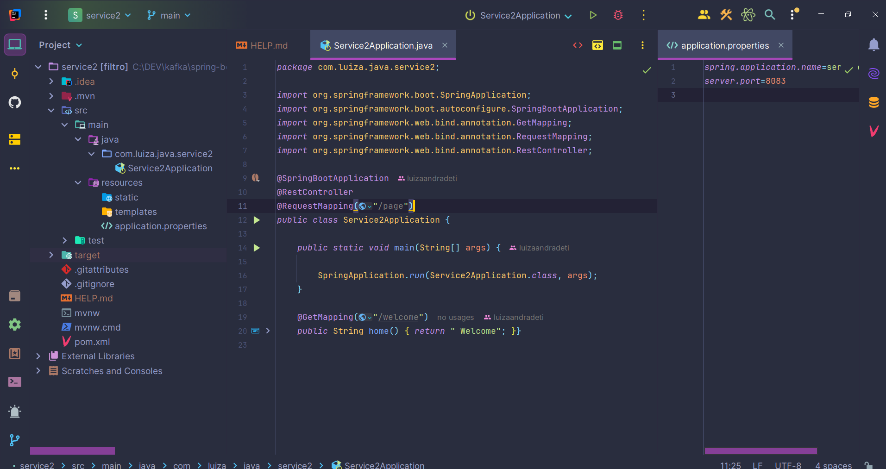
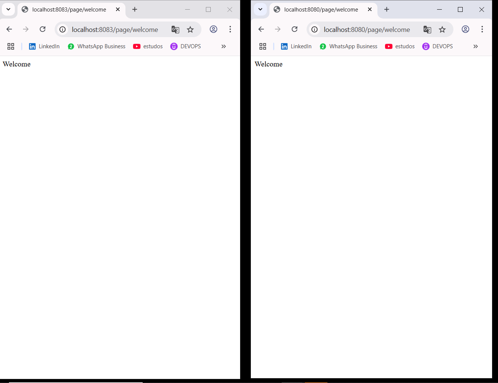

"# Java-API-Spring-Cloud" 

##### 1. Conteúdo para construção em Spring Cloud com Java 17, seguindo diretrizes da Documentação Oficial do Spring Framework, em ambiente não produtivo:

- https://cloud.spring.io/
- https://spring.io/guides/gs/gateway
- https://www.alura.com.br/artigos/o-que-sao-ambientes?

##### 1.2 Conteúdo de Segurança do Spring:

- https://spring.io/projects/spring-security

> [!NOTE]
>
> 
> Código elaborado com finalidade de estudo, sem fins políticos. 
